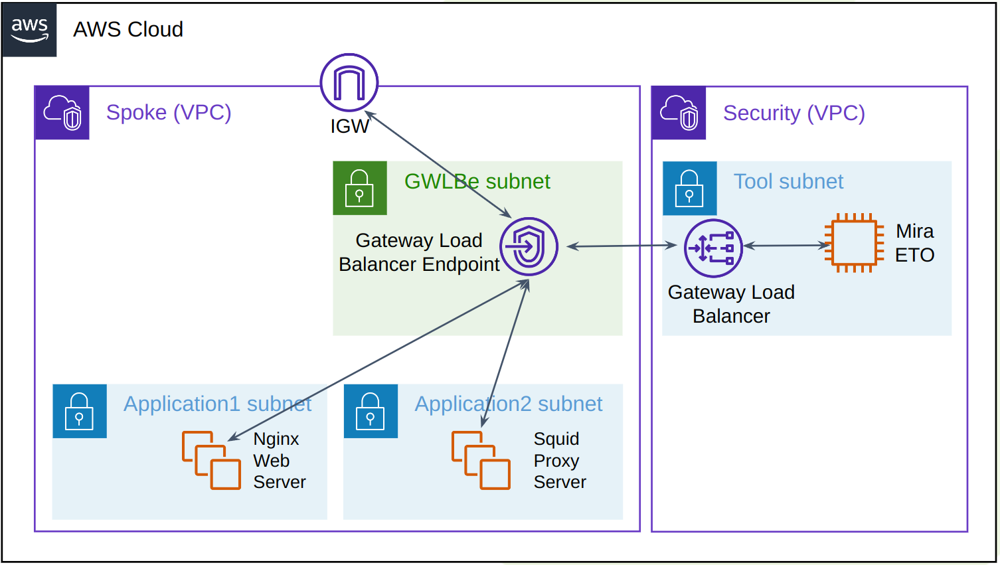
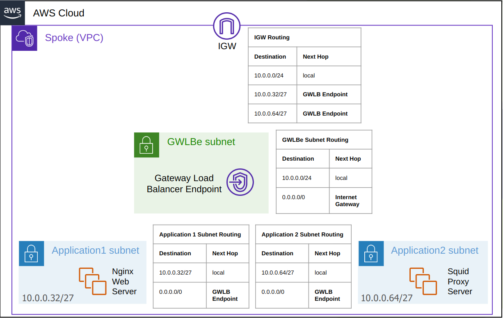

# **Test Applications Spoke VPC**

This Applications Spoke example contains a Nginx server with an automatically generated self signed certificate and a Squid proxy server which can be used to route a client’s web traffic through the GWLB and ETO.

_Figure 1: Nginx and Squid Client traffic routing to GWLBe_

The route tables are set up to ensure all North/South appliance traffic to the IGW goes via the GWLB and ETO. Also East/West traffic between the Application 1 and Application 2 subnets will also be routed through the GWLB.

_Figure 2: Route tables to ensure all traffic East/West and North/South go via the GWLBe_

### Creating CloudFormation stack

A Security VPC must have already been created and its GWLB VPC Endpoint service name must be known before proceeding with this example.

* **The steps to install the VPC-Spoke stack are as follows:**
    1. Create a new stack and upload the VPC-Spoke.yaml file
    2. The stack should be given a unique name
    3. Under Gateway Load Balancer Endpoint Configuration, The GWLB endpoint service obtained from the security stack should be entered
    4. Under Security Groups, a SSH key pair should be selected for the EC2s
    5. Under Application 2 Proxy Configuration, the proxy username and password may be set within the form. The default is user/GreenPenguin7

Click **Next** and **Next** again on the following page, followed by **Submit**.

The CloudFormation will take 5 minutes to complete. Once ready the Nginx and Squid proxy EC2s will appear within the EC2 console. The servers will take a further 2 minutes to set up their server applications after the CloudFormation setup is complete.

Traffic going to and from the Spoke Servers will now go via the GWLB and ETO appliance.

## Testing the Environment with Traffic
### **Nginx Test**
The Nginx web service can be accessed by clicking open address on the Nginx EC2 details within the AWS console. The ETO will decrypt the traffic by replacing the self-signed Nginx certificate.

All flows going to the Nginx server should be logged within the ETO session log once the ETO has an activated segment.

If the Nginx web server is given a publicly signed web certificate, this may be imported into the ETO to allow for it to be re-used as a known server key. Please consult the ETO documentation for more information.

### **Squid Proxy Test**

When a browser connects via this proxy, the ETO will resign the publicly accessed websites with its own Internal Certificate Authority (CA). This may be exported from the ETO PKI using the export function. This CA needs to be imported and trusted by the browser.

An additional ETO policy rule is required to prevent both inbound and outbound proxy decryption. This may be configured by going to the ETO Policies, selecting the Policy in use and adding a new Rule List and adding a Rule to the Rule list with Action: Bypass and match the rule against Server Port 3128 and click Save. The Segment needs to be re-activated for the changes to take effect.

The proxy is available at [endpoint2-proxy-elastic-IP]:3128. An internet browser running on an external computer can connect to this HTTPS proxy with the username and password previously set. All websites accessed on the browser will go via this proxy.

The Resign action may be validated by viewing the certificate information on the web browser and inspecting the certificate's issuer name which should have the same as the CA within the ETO PKI store. Also the ETO session logs should have 2 logs per web flow, the first inbound to the proxy port should be bypassed whilst the flow re-emerging outbound should be resigned. The attached IDS also should log the decrypted HTTP payloads and if any security alerts are triggered.

## **Cleanup**

If the sample resources are no longer needed, the resources may be deleted by navigating to CloudFormation and deleting the Spoke VPC.
