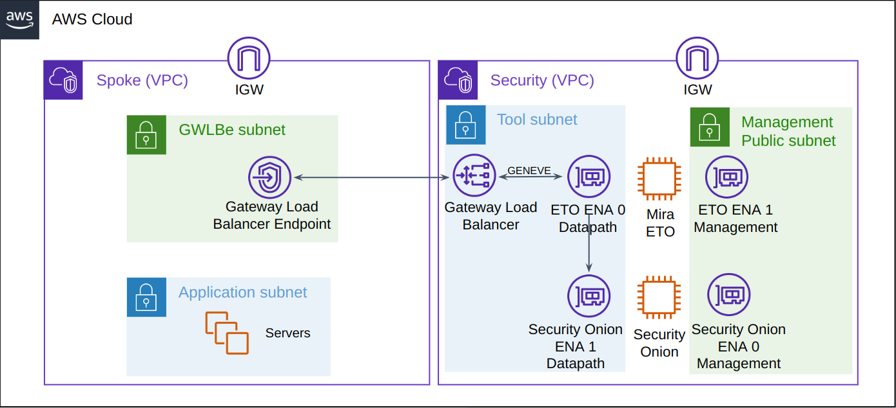
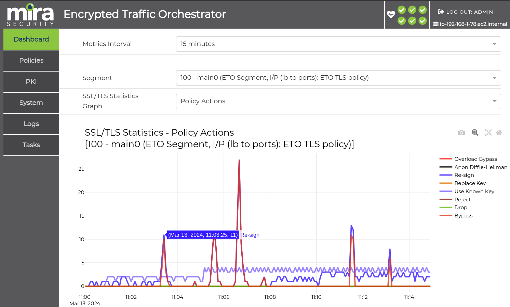
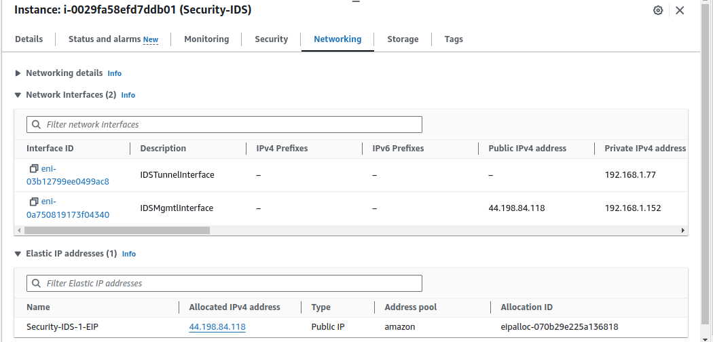
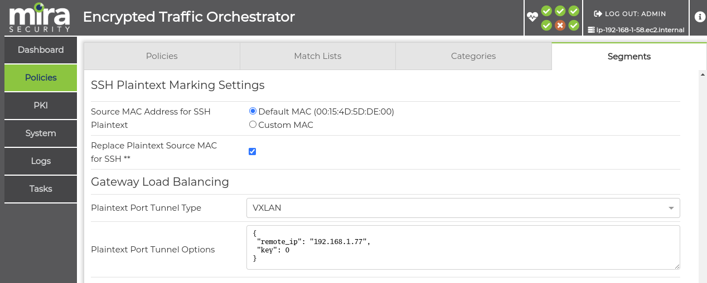
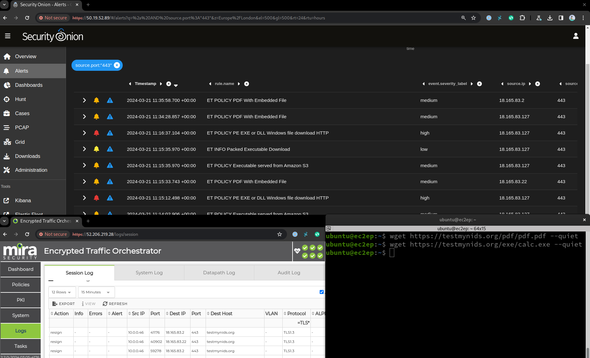

# Mira ETO with AWS GWLB and Security Onion Platform

This sample contains CloudFormation templates which demonstrates how to create a [Mira Encrypted Traffic Orchestrator (ETO)](https://mirasecurity.com/how-mira-works/eto-aws/) with a [Gateway Load Balancer (GWLB)](https://docs.aws.amazon.com/elasticloadbalancing/latest/gateway/introduction.html) and [Security Onion 2](https://aws.amazon.com/marketplace/pp/prodview-4gpqv3qlxq4ww), an open source threat hunting tool available on AWS marketplace.

This example is intended for initial proof of concept test beds. The ETO and tool will only get deployed into a single availability zone within this example.

_Figure 1: GWLB with Mira ETO and Security Onion Architecture_

The AWS Gateway Load Balancer routes the Spoke VPC traffic over to the Security VPC for traffic inspection. Mira ETO automatically detects SSL, TLS and SSH traffic on any port and can decrypt this traffic in order to send the unencrypted data to one or more security tools. The decrypted flows may be sent to a passive security tool using GENEVE or VXLAN tunnels. Decrypted data is sent to security tools with the same packet header details as the original encrypted flow encapsulated within the tunnel. Both outbound and inbound TLS flows can be decrypted using Certificate Authority resign or using existing server certificates and keys.

_Figure 2: Mira ETO Dashboard showing decryption policy actions_

## **Security VPC**
The ETO requires two Elastic Network Adapter (ENA) interfaces. The first for the datapath traffic connection to GWLB and for transmitting plaintext decrypted traffic to the security tool, the second interface for the management WebUI and SSH.

The management interface of ETO is put into a public subnet, allowing for internet access to the management WebUI to be quickly provided if the ETO ENA is given an Elastic public IP, however a public IP should not be set up in a real production environment and the management interface should instead be placed into a private management subnet.

This CloudFormation template also installs a Security Onion EC2 using the marketplace AMI. This tool is optional and may be disabled within the CloudFormation parameters.

### Obtaining ETO AMI ID
If an AWS marketplace subscription is active for the [Mira ETO](https://aws.amazon.com/marketplace/seller-profile?id=seller-vh5fkitegcazg), the AMI ID may be obtained from the marketplace product, by clicking on “**Continue to Subscribe**” followed by “**Continue to Configuration**.” The desired ETO software version and region may be chosen which will provide the relevant AMI ID that can later be used in the CloudFormation submission.

### Obtaining Security Onion AMI ID

A Security Onion may be obtained from the [AWS marketplace listing](https://aws.amazon.com/marketplace/pp/prodview-4gpqv3qlxq4ww) using the same method as described in the previous section.

### Creating CloudFormation stack

* **The steps to install the VPC-Security stack are as follows:**
    1. Navigate to AWS CloudFormation and create a new stack and upload the VPC-Security.yaml file
    2. Give the VPC a unique Stack Name and select a availability zone
    3. Under Security Groups and Keys, assign the EC2s a SSH KeyPair
    4. Under Security Groups and Keys, set the network CIDR subnet that can access the appliances management interfaces, the default 0.0.0.0/0 will create a security group rule to allow access from any client. To only allow SSH/Webui access from a single IP this may be set here, e.g. 21.22.11.55/32
    5. Under Decryptor Appliance Configuration, the ETO AMI ID should be entered, this is unique per AWS region and ETO license type
    6. The Decryptor instance type may be lowered to a lower cost type. If the AMI is obtained from the marketplace, ensure the chosen value matches a valid EC2 instance type as shown on the marketplace listing. The [Virtual ETO Product Brief](https://mirasecurity.com/resources/) also details the CPU and memory requirements for each licensed capacity
    7. Under IDS Tool settings, the Security Onion AMI ID should be entered, this is unique per AWS region

The other fields may be left at the default values. By default an Elastic IP will be assigned to the EC2 management interfaces but this should be disabled if access is available using the private IP.

Once the form has been completed, click **Next**, followed by **Next**. Check the checkbox to allow for IAM capabilities to be created and click **Submit**.
The IAM role is required to run a lambda script to provide the ApplianceVPCEndpointServiceName in the CloudFormation outputs to make this sample easier to use.

The CloudFormations yaml file will now create a new Security VPC, GWLB and EC2 instances. The stack progress may be monitored by clicking the refresh button. The stack should move to a CREATE_COMPLETE stage.

Navigate to the CloudFormation stack outputs tab and note the ApplianceVPCEndpointServiceName, this is the unique ID for the GWLB Endpoint Service and will be needed when connecting a Spoke’s Gateway Load Balancer Endpoint into this Security Stack.

_Figure 3: CloudFormation output tab_

### Checking security appliance health

The ETO will take up to 5 minutes to come online and by default the ETO starts in “wire mode”, allowing traffic through but not decrypting until a license and configuration is applied. The Load Balancer health check should provide a healthy status for the ETO, this may be tracked within the AWS EC2 Target Group named [stack-name]-tg-1. The application Spoke VPC should not be set up until the ETO returns a healthy status.

### **Mira ETO set up**

The default password for the console “mira” user and WebUI “admin” user is the EC2 [instance-id], available from the AWS instance console. This will need to be reset on the first login.

The ETO web management IP may be opened by copying the management network interface IP address from the EC2 Networking tab and prepending https://.

ETO configuration is carried out using the ETO's web UI to enable decryption and send plaintext traffic to Security Onion. This is described within the ETO Virtual Appliance Getting Started Guide and ETO Administration Guide available from the [Mira Support Site](https://support.mirasecurity.com).

A video showing how to set up a minimum decryption policy is also shown below.

For this AWS deployment, the ETO Segment "Plaintext Port Tunnel Type" field also should be set to VXLAN and the remote_ip set to the Security Onion datapath IP (Name: IDSTunnelInterface). The Tunnel Virtual Network Identifier (VNI) key can be left at 0.

_Figure 4: IDS EC2 networking tab_

_Figure 5: Mira ETO Segment plaintext tunnel settings_

Once the segment is reactivated the Security Onion tool should get a copy of the decrypted traffic. The flows to the Spoke servers will be logged in the ETO session log.

Note, set up can also be performed using the inbuilt ETO REST API as described within the REST API Getting Started Guide and demonstrated within the [REST API Examples](https://github.com/mirasecurity/restapi-examples).

### **Security Onion set up**

To set up the Security Onion threat hunting platform, SSH into EC2's onion user account and consult the [Security Onion official documentation](https://docs.securityonion.net/en/2.4/cloud-amazon.html#)

It is recommended to first cancel the wizard and disable the datapath sniffing interface IP address, otherwise the VM may try to use it for the package downloads and fail, instead of using the management interface which has the public Internet access.

To disable the sniffing interface IP, issue the following commands.
> sudo nmcli connection modify Wired\ connection\ 1 ipv4.method disabled ipv6.method disabled \
> sudo nmcli connection up Wired\ connection\ 1

A new SSH session may then be created to restart the wizard. It is recommended to set up security onion in either evaluation or standalone as there is only a single Security Onion EC2 installed.

To allow for access to the WebUI externally using its public Elastic IP, when asked "How would you like to access the web interface?" select other and enter the EC2's Public IP, which may be copied from the AWS EC2 console by inspecting the SecurityOnion's IDSMgmtInterface within the EC2 networking tab. The eth0 should be chosen for management and eth1 for the security tool monitoring.

After installation has completed, the Security Onion web management IP may be opened by copying the management network interface IP address from the EC2 Networking tab and prepending https://.

Decrypted HTTPS traffic should now be sent from the ETO to the tool and any threats will appear within Alerts.

Note rule sids 2013926-2013931 which relate to 'ET POLICY HTTP traffic on port 443' can be disabled on Security Onions idstools configuration and Port 443 can be added to Suricata -> config -> vars -> port-groups -> HTTPPORTS as decrypted traffic on port 443 is now expected.

After the endpoint VPC routing is set up as detailed in the next section, the Security Onion IDS should be able to detect threats within the decrypted HTTPS traffic.

_Figure 6: Mira ETO decrypting testmynids.org HTTPS traffic allowing Security Onion to trigger an alert for the malicious traffic_

### **Endpoint Spoke VPC set up**

The Spoke VPCs should now be set up to route the traffic via the GWLB using subnet routing.

For a simple client testbed, a VPC including a Nginx and Squid proxy server is available in the [1az-applications-spoke](../1az-applications-spoke/) directory.

To secure an pre-existing VPC, a Gateway Load Balancer Endpoint should be created in that VPC to connect
into the GWLB. The GWLB Endpoint name that it will connect to was obtained earlier from the Cloudformation output tab field ApplianceVPCEndpointServiceName.
Consult the [AWS GWLB Getting Started Docs](https://docs.aws.amazon.com/elasticloadbalancing/latest/gateway/getting-started.html) for more information on how to set this up.
[VPC middlebox routing wizard](https://docs.aws.amazon.com/vpc/latest/userguide/gwlb-route.html) also can be used to automate the subnet routing.

## **Cleanup**

If the sample resources are no longer needed, the resources may be deleted by stopping all the EC2 instances and navigating to CloudFormation and deleting any Spoke VPCs that connect into the GWLB, followed by deleting this Security VPC.
