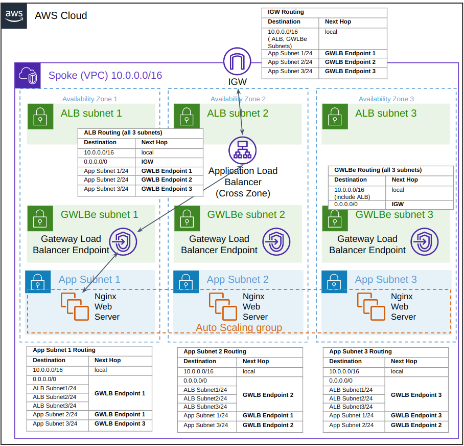

# **Test Applications Nginx Spoke VPC (3 Availability Zones)**

This Applications Spoke example contains 3AZs with a autoscaling group consisting of Nginx EC2s.

The route tables are set up to ensure all North/South appliance traffic to the IGW goes via the GWLB and ETO. Also East/West traffic between the Application subnets will also be routed through the GWLB.

 \
_Figure 1: Route tables to ensure all traffic East/West and North/South go via the GWLBe_

The Application Load Balancer (ALB) will require a certificate that is stored within AWS ACM. This Cert ARN will need to be specified within the CloudFormation submission, usually this will be a publically trusted cert, but may also be a self signed cert for lab setup.

The ALB has cross zone support enabled, allowing traffic to Enter AZ-2 and move across to Nginx in AZ-1, therefore the subnet routing is setup accordingly to ensure the same GWLBe is used for both directions of the flow.

The normal path for inbound traffic is external client -> IGW -> ALB -> GWLBe -> Nginx EC2.

For outbound traffic e.g. Nginx EC2 downloading OS packages, the flow will be Nginx EC2 -> GWLBe -> IGW. The Nginx EC2 also gets a public IP to allow for this to take place easily in the test bed.

The ALB does not check the certificate validatity of the backend, therefore the Nginx EC2s are set up with a self signed cert and the ETO in the Security VPC may also just do a replace-key on the self signed cert requiring minimal PKI set up. Only the ALB requires the publically trusted certificate and key which is the benefit of this schematic. For EC2s accessing the internet, the EC2s will require the ETO resign CA to be imported and trusted. Example code to do this is in the yaml file commented out within the Application1LaunchTemplate section but does not need to be set up for this basic example.

The ALB could alternatively be placed after the GWLBe in the App Subnet but this would require the ETOs in the Security VPC to also have the external PKI.

### Creating CloudFormation stack

A Security VPC must have already been created that is available over the same 3 Availability Zones and its GWLB VPC Endpoint service name must be known before proceeding with this example.

* **The steps to install the VPC-Spoke stack are as follows:**

    1. Create a new stack and upload the VPC-Spoke-3az-nginx.yaml file
    2. The stack should be given a unique name
    3. Choose the 3 AZs to be used for the test setup
    4. Under Gateway Load Balancer Endpoint Configuration, the GWLB endpoint service obtained from the security stack should be entered
    5. Under Security Groups, a SSH key pair should be selected for the EC2s
    6. Under ALB Configuration, insert the ARN of the certificate in AWS ACM that should be used by the ALB

Click **Next** and **Next** again on the following page, followed by **Submit**.

The CloudFormation Stack will take several minutes to complete.

Traffic going to and from the Spoke Servers will now go via the GWLB and ETO appliance. By Default the client auto scaling group will be set at zero capacity.

## Testing the Environment with Traffic

Clients may be created using EC2 autoscaling, by navigating to "Auto Scaling Groups" on the AWS EC2 dashboard and selecting {stackname}-ClientsASG. On Group Details, click edit and increment Desired Capacity to the capacity desired and click update. The EC2 will be distributed across the multiple AZs. The EC2s will auto download Nginx and install a self signed TLS cert.

Navigating to CloudFormation Outputs, Copy the LoadBalancerUrl and use this to access the ALB. On each refresh, a new EC2 should be shown with altering webpage contents.

## **Cleanup**

If the sample Autoscaled resources are no longer needed, the Autoscaled EC2s may be removed by setting the Clients AutoScaling Desired Capacity to 0.
To delete the entire CloudFormation Stack, navigate to CloudFormation and deleting the Spoke VPC.
