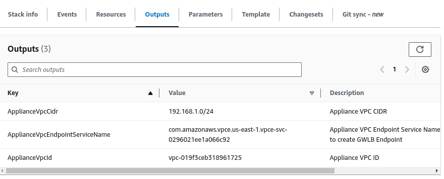

# AutoScaling Mira ETO with Lambda API script and Suricata

This sample contains a CloudFormation template which demonstrates how to create a Autoscaling [Mira Encrypted Traffic Orchestrator (ETO)](https://mirasecurity.com/how-mira-works/eto-aws/) with a [Gateway Load Balancer (GWLB)](https://docs.aws.amazon.com/elasticloadbalancing/latest/gateway/introduction.html) and [Suricata](https://suricata.io/). The [python-lambda](python-lambda) scripts will automatically deploy Policies and Configuration to the Auto Scaled ETOs using Infrastructure as Code. This example aims to show how the inbuilt ETO REST API can fully automate the set up process. More detailed REST API examples are available on [the RESTAPI-examples Github repo](https://github.com/mirasecurity/restapi-examples)

A jump box ubuntu EC2 can optionally be created to allow access to the ETO and Suricata testbed by jumping through it for SSH or using it as a SOCKS proxy to access the ETO's WebUI.
This example is intended for initial proof of concept test beds. The NAT gateway and jumpbox will only get deployed into a single availability zone within this example. These should be replicated to multiple AZs for production usage.

The ETO AMI needs to be licensed using an hourly ETO marketplace AMI.

 \
_Figure 1: Lambda setup script with autoscaling ETOs and Suricata Architecture_

The AWS Gateway Load Balancer routes the Spoke VPC traffic over to the Security VPC for traffic inspection and into an available ETO instance. The Mira ETO automatically detects SSL, TLS and SSH traffic on any port and can decrypt this traffic in order to send the unencrypted data to one or more security tools. The decrypted flows may be sent to a passive security tool using GENEVE or VXLAN tunnels. Decrypted data is sent to the Suricata Network Load Balancer with the same packet header details as the original encrypted flow encapsulated within the tunnel. Both outbound and inbound TLS flows can be decrypted using Certificate Authority resign or using existing server certificates and keys.

The Suricata Network Load Balancer will distribute the decrypted traffic to the Suricata Tools. The Suricata tools will send any alerts in the Suricata eve.json and fast.log file to AWS CloudWatch for centralized log analysis.
The Suricata NLB will have a static defined IP in each Availability Zone which the ETOs may use to know where to send the plaintext to.

When a ETO autoscaling event occurs, AWS EventBridge will trigger a custom Lambda script that will automatically reset the ETO admin password to the password autogenerated by CloudFormation and stored within Secrets Manager. The script will also create a new resign Certificate Authority unless (optionally) one is stored separately in Secrets Manager and its path name is provided within the CloudFormation submission. A catch all decrypt policy with a match rule list to bypass *amazonaws.com sessions will be created, this is to allow AWS SSM traffic to pass through unaltered. If server certificates are configured and are available within Secrets Manager, these will also be imported into a PKI matchlist and linked into the policy to allow their use for known server key decryption.  A segment will be created to send the plaintext app traffic to the relevant NLB IP based on the ETOs AZ. This Lambda script will also log events to CloudWatch for debugging purposes.

\
_Figure 2: Overview of event driven architecture to auto configure ETOs using Lambda_

## **Security VPC**
The ETO requires two Elastic Network Adapter (ENA) interfaces. The first for the datapath traffic connection to GWLB and for transmitting plaintext decrypted traffic to the security tool, the second interface for the management WebUI and SSH. The Suricata EC2 requires one ENA interface.

The optional jump box in this example is placed into the public Subnet to allow for easy external access to the testbed.
Both ETO network interfaces are placed into a private Tool Subnet with a private IP that is only reachable from within the AWS VPC. The Suricata EC2 is also placed within the private Tool Subnet. A NAT gateway is created to provide the Suricata and ETOs outbound internet access for downloads. The Lambda Script also uses the NAT gateway to get access to the AWS API to get the required EC2 metadata/IP addresses.

### Obtaining ETO AMI ID
If an AWS marketplace subscription is active for the [Mira ETO](https://aws.amazon.com/marketplace/seller-profile?id=seller-vh5fkitegcazg), the AMI ID may be obtained from the marketplace product, by clicking on “**Continue to Subscribe**” followed by “**Continue to Configuration**.” The desired ETO software version and region may be chosen which will provide the relevant AMI ID that can later be used in the CloudFormation submission. For this example a marketplace licensed AMI is required, a license is not issued by this script so BYOL can not be used.

### Creating Python Lambda environment zip

The Lambda code is already packaged and stored on a [public S3 bucket](https://mira-public-aws-examples.s3.amazonaws.com/3az-security-eto-asg-api-suricata/python-lambda.zip) which can be used for the CloudFormation submission, but for AWS accounts with production data, the code should be built and stored independently on the customers private AWS S3 environment. To self host or alter the Lambda code, perform the following steps

    1. cd python-lambda
    2. pip install -r requirements.txt --target .
    3. zip -r ../python-lambda .
    4. cd ../

The python-lambda.zip file is now available within the main example directory and can be uploaded to S3.
If a version other than Python 3.12 was used for packaging the zip, then the yaml file ManageETONodesAutoscaling RunTime field should be updated to match the Python version used.

### Creating CloudFormation stack

* **The steps to install the VPC-Security-API-ASG stack are as follows:**

    1. Navigate to AWS CloudFormation and create a new stack and upload the VPC-Security-API-ASG.yaml file
    2. Give the VPC a unique Stack Name and select three different availability zones
    3. Under Security Groups and Keys, assign the EC2s a SSH KeyPair
    4. Under Security Groups and Keys, set the network CIDR subnet that can access the appliances management interfaces, the default 0.0.0.0/0 will create a security group rule to allow access from any client. To only allow SSH/Webui access from a single IP this may be set here, e.g. 21.22.11.55/32
    5. Under Decryptor Appliance Configuration, the ETO AMI ID should be entered, this is unique per AWS region and ETO license type
    6. The Decryptor instance type may be lowered to a lower cost type. If the AMI is obtained from the marketplace, ensure the chosen value matches a valid EC2 instance type as shown on the marketplace listing. The [Virtual ETO Product Brief](https://mirasecurity.com/resources/) also details the CPU and memory requirements for each licensed capacity
    7. Under Decryptor AutoScaling Setup, enter the S3 Bucket and Location of the zip file for Lambda, for testbeds the script located at S3 Bucket Name mira-public-aws-examples and Key 3az-security-eto-asg-api-suricata/python-lambda.zip may be used.
    8. The CA PEM Secrets Manager location may be left blank, a new CA will be auto generated, however if an existing CA exists and needs to be used by the ETO, consult the "Storing CA PEM file in Secrets Manager" section later in this README.
    9. The Tag Key Name for Server Keys within Secrets Manager key name may be left blank, or if existing server certs and keys exists, consult the "Storing Server Certs PEM file in Secrets Manager" section later in this README.

The other fields may be left at the default values. By default a jump box Ubuntu EC2 with a Public IP will be created but this can be disabled if desired.

Once the form has been completed, click **Next**, followed by **Next**. Check the checkbox to allow for IAM capabilities to be created and click **Submit**.
The IAM role is required to run a Lambda script to provide the ApplianceVPCEndpointServiceName in the CloudFormation outputs to make this sample easier to use.

The CloudFormations yaml file will now create a new Security VPC, GWLB and autoscaling groups. The stack progress may be monitored by clicking the refresh button. The stack should move to a CREATE_COMPLETE stage.

Navigate to the CloudFormation stack outputs tab and note the ApplianceVPCEndpointServiceName, this is the unique ID for the GWLB Endpoint Service and will be needed when connecting a Spoke’s Gateway Load Balancer Endpoint into this Security Stack.

 \
_Figure 4: CloudFormation output tab_

ETOs may now be created using EC2 autoscaling, by navigating to ["Auto Scaling Groups"](https://us-east-1.console.aws.amazon.com/ec2/home?region=us-east-1#AutoScalingGroups:) on the AWS EC2 dashboard and selecting {stackname}-DecryptorASG. On Group Details, click edit and increment Desired Capacity to the capacity desired and click update. The EC2 will be distributed across the multiple AZs.

An ETO EC2 should now be created, and Lambda should run to auto configure it, the Lambda logs may be monitored by opening [AWS CloudWatch](https://us-east-1.console.aws.amazon.com/cloudwatch/) Clicking Live Tail on the left pane and watching log group /aws/lambda/{stackname}-ManageETONodesAutoscaling and apply the filter. The Lambda script will log the stages of deployment.

### **Suricata Autoscaling set up**

The Suricata autoscaling group requires no configuration. It just needs to be given a desired capacity similar to the ETO, by navigating to "Auto Scaling Groups" on the AWS EC2 dashboard and selecting {stackname}-IDSASG. On Group Details, click edit and increment Desired Capacity to the capacity desired and click update.

Suricata EC2s will spin up and auto download the Suricata docker image. The suricata eve.json and fast.log alerts will be sent to CloudWatch within the /{stackname}/suricata/eve and /fast groups.

### **Accessing EC2s via Jump Box**

The ETO and Suricata EC2s may be accessed by SSHing into the jump box followed by SSH into the EC2. A socks proxy (-D) may also be used to access the ETO WebUI

e.g. ssh ubuntu@jumpboxip -A -D 9191 # -A allows ssh key forwarding, -D sets up socks proxy

Then ssh into the ETO management interface from that terminal, or set your web browser sockets proxy to localhost:9191 to get access to the ETO via the jumpbox socket.
The ETO WebUI password will be set by the Lambda code to the one autogenerated within Secrets Manager item named after the stack name.

### **Endpoint Spoke VPC set up**

The Spoke VPCs should now be set up to route the traffic via the GWLB using subnet routing. For all ETOs to be utilized, the Spoke VPC should also be located over 3 AZs.

For a simple client testbed, a VPC including 3AZs and autoscaling clients is available within the [3az-applications-spoke-nginx](../3az-applications-spoke-nginx/) directory.

To secure an pre-existing VPC, a Gateway Load Balancer Endpoint should be created in that VPC to connect
into the GWLB. The GWLB Endpoint name that it will connect to was obtained earlier from the Cloudformation output tab field ApplianceVPCEndpointServiceName.
Consult the [AWS GWLB Getting Started Docs](https://docs.aws.amazon.com/elasticloadbalancing/latest/gateway/getting-started.html) for more information on how to set this up.
[VPC middlebox routing wizard](https://docs.aws.amazon.com/vpc/latest/userguide/gwlb-route.html) also can be used to automate the subnet routing.

### (Optional) Storing CA PEM File in Secrets Manager

* To supply a pre-existing Certificate Authority and Key, perform the following steps

    1. Navigate to [AWS Secrets Managers](https://us-east-1.console.aws.amazon.com/secretsmanager/newsecret?region=us-east-1) and create a new secret
    2. Choose "Other type of secret"
    3. Choose Plaintext as secret data type
    4. Paste the contents of the PEM file containing the CA certificate and private key into the textbox and click next
    5. Give the Secret a unique name and click Next
    6. Disable automatic rotation and click Next, followed by Store.
    7. Use the Secret Name just chosen within the CloudFormation submission

The Lambda script should be self hosted in a private S3 bucket to ensure the script accessing the PEM data is managed by the customer.

### (Optional) Storing Server Certificate and Key PEM files in Secrets Manager

* To supply a pre-existing Server Certificate and Keys, perform the following steps

    1. Navigate to [AWS Secrets Managers](https://us-east-1.console.aws.amazon.com/secretsmanager/newsecret?region=us-east-1) and create a new secret
    2. Choose "Other type of secret"
    3. Choose Plaintext as secret data type
    4. Paste the contents of the PEM file containing the Server certificate and private key into the textbox and click next
    5. Give the Secret a unique name
    6. Within Tags click Add and give the Tag Key a Key Name to be able to later uniquely find the cert within secrets manager e.g. ServerCerts, the value may be left empty and click Next
    7. Disable automatic rotation and click Next, followed by Store.
    8. Use the Tag Key Name chosen within the CloudFormation submission

This process may be repeated multiple times for multiple certificates, the lambda script will iterate through all items and ensure they're all imported into the ETO.

## **Cleanup**

If the sample Autoscaled resources are no longer needed, the Autoscaled EC2s may be deleted by setting the Decryptor and Suricata AutoScaling Desired Capacity to 0. The ETO may take several minutes to stop, determined by the termination wait time set within the CloudFormation/AutoScaling group which is there to ensure existing flows have a chance to finish before the ETO is terminated.
To delete the entire CloudFormation Stack, navigate to CloudFormation and delete any Spoke VPCs that connect into the GWLB, followed by delete this Security VPC.

Note: These are all samples and may not be suitable for production use.
