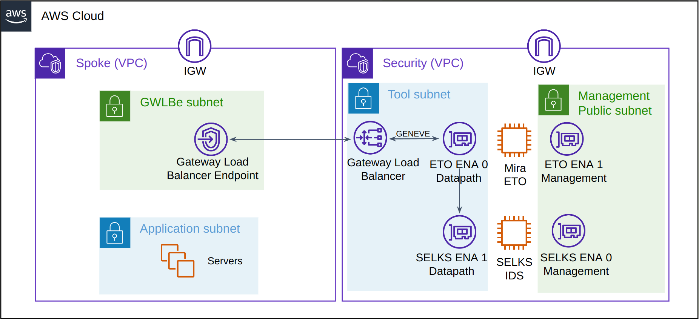

# Mira ETO with AWS Gateway Load Balancer and SELKS IDS

This sample contains CloudFormation templates which demonstrates how to create a [Mira Encrypted Traffic Orchestrator (ETO)](https://mirasecurity.com/how-mira-works/eto-aws/) with a Gateway Load Balancer (GWLB) and Stamus Networks [SELKS IDS](https://github.com/StamusNetworks/SELKS), a open source security tool based on Suricata.

This example is intended for initial proof of concept set ups, as the ETO does not get deployed into multiple availability zones within this guide.

_Figure 1: GWLB with Mira ETO and SELKS Architecture_

## **Security VPC**
The ETO requires two ENA network interfaces. The first for the datapath traffic connection to GWLB and for transmitting plaintext decrypted traffic to the security tool, the second interface for the management WebUI and SSH.

The management interface of ETO is put into a public subnet, allowing for internet access to the management WebUI to be quickly provided if the ETO ENA is given an elastic public IP, however a public IP should not be set up in a real production environment and the management interface should instead be placed into a private management subnet.

This CloudFormation template also installs a open source Suricata based platform from the [Stamus Networks SELKS repository](https://github.com/StamusNetworks/SELKS). This tool is optional and may be disabled within the CloudFormation parameters.

### Obtaining ETO AMI ID
If an AWS marketplace subscription is active for the [Mira ETO](https://aws.amazon.com/marketplace/seller-profile?id=seller-vh5fkitegcazg), the AMI ID may be obtained from the marketplace product, by clicking on “Continue to Subscribe” followed by “Continue to Configuration”. The desired ETO software version and region may be chosen which will provide the relevant AMI ID that can later be used in the CloudFormation submission.

Alternatively an AMI may be shared privately to the customer account by Mira Support. A ticket should be opened on the [Mira Support Site](https://support.mirasecurity.com) requesting a product trial, along with the AWS account ID and region required.

### Creating CloudFormation stack

* **The steps to install the VPC-Security stack are as follows**
    1. Navigate to AWS CloudFormation and create a new stack and upload the VPC-Security.yaml file.
    2. Give the VPC a unique Stack Name.
    3. Under Security Groups and Keys, assign the EC2s a SSH KeyPair.
    4. Under Security Groups and Keys, set the Network CIDR that can access the appliances management interfaces, the default 0.0.0.0/0 will create a security group rule to allow access from any client. To only allow SSH/Webui access to a single IP this may be set here, e.g. 21.22.11.55/32
    5. Under Decryptor Appliance Configuration, the ETO AMI ID should be entered, this is unique per AWS region and ETO model type.
    6. The Decryptor instance type may be lowered to a lower cost type. if the AMI is obtained from the marketplace, ensure the chosen value matches a valid EC2 instance type as shown on the marketplace listing. The [Virtual ETO Product Brief](https://mirasecurity.com/resources/) also details the CPU and memory requirements for each licensed capacity.

The other fields may be left at the default values. By default an Elastic IP will be assigned to the EC2 management interfaces but this should be disabled if access is available using the private IP.

Once the form has been completed, click Next, followed by Next. Check the checkbox to allow for IAM capabilities to be created and click Submit.
The IAM role is required to run a lambda script to provide the ApplianceVPCEndpointServiceName in the CloudFormation outputs to make this sample easier to use.

The CloudFormations yaml file will now create a new Security VPC, GWLB and EC2 instances. The stack progress may be monitored by clicking the refresh button. The stack should move to a CREATE_COMPLETE stage.

Navigate to the CloudFormation stack outputs tab and note the ApplianceVPCEndpointServiceName, this is the unique ID for the GWLB Endpoint Service and will be needed when connecting a Spoke’s Gateway Load Balancer Endpoint into this Security Stack.

### Checking security appliance health

The ETO will take up to 5 minutes to come online and by default the ETO starts in “wire mode”, allowing traffic through but not decrypting until a license and configuration is applied. The Load Balancer health check should provide a healthy status for the ETO, this may be tracked within the AWS EC2 Target Group named [stack-name]-tg-1. The next Spoke VPC should not be created until the ETO returns a healthy status.

### **Mira ETO set up**

The default password for the console “mira” user and WebUI “admin” user is the EC2 [instance-id], available from the AWS instance console. This will need to be reset on the first login.

The ETO web management IP may be opened by copying the management network interface IP address from the EC2 Networking tab and prepending https://.

ETO configuration is carried out using the ETO's web UI to enable decryption and send plaintext traffic to SELKS. This is described within the ETO Virtual Appliance Getting Started Guide and ETO Administration Guide available from the [Mira Support Site](https://support.mirasecurity.com).

Note, set up can also be performed using the inbuilt ETO REST API as described within the REST API Getting Started Guide and demonstrated within the [REST API Examples](https://github.com/mirasecurity/restapi-examples).

Once the ETO is set up with PKI, Policies and Segments, the flows to the Spoke servers will be logged in the ETO session log.

The ETO Segment "Plaintext Port Tunnel Type" field should be set to Geneve and the remote_ip set to SELKS datapath IP (Name: IDSTunnelInterface). Once the segment is reactivated the SELKS tool should get a copy of the decrypted traffic.

### **SELKS IDS set up**

The SELKS IDS web management IP may be opened by copying the management network interface IP address from the EC2 Networking tab and prepending https://.
The default username/password for the SELKS EC2 is selks-user/selks-user.

The Security Tool events may be viewed on the IDS WebUI, this may be viewed at https://[selks-ids-ip]/evebox/#/events after logging in with the default username/password.
The SELKS IDS also should log the decrypted HTTP payloads and if any Suricata security alerts are triggered, this also should be logged under Alerts.

### **Client VPC set up**

The Spoke VPCs should now be set up to route the traffic via the GWLB using subnet routing. A new Gateway Load Balancer Endpoint is required in the Spoke VPCs to connect
into the GWLB, The GWLB Endpoint name that it will connect to was obtained earlier from the Cloudformation output tab field ApplianceVPCEndpointServiceName.
Consult the [GWLB Getting Started Docs](https://docs.aws.amazon.com/elasticloadbalancing/latest/gateway/getting-started.html) for more information on how to set this up.
[VPC middlebox routing wizard](https://docs.aws.amazon.com/vpc/latest/userguide/gwlb-route.html) also can be used to automate the subnet routing.

For a simple client testbed, a VPC including a Nginx and Squid proxy server is also available in the [base-clients](../base-clients/) directory.

## **Cleanup**

If the sample resources are no longer needed, the resources may be deleted by navigating to CloudFormation and deleting any Spoke VPCs that connect into the GWLB, followed by deleting this Security VPC.
